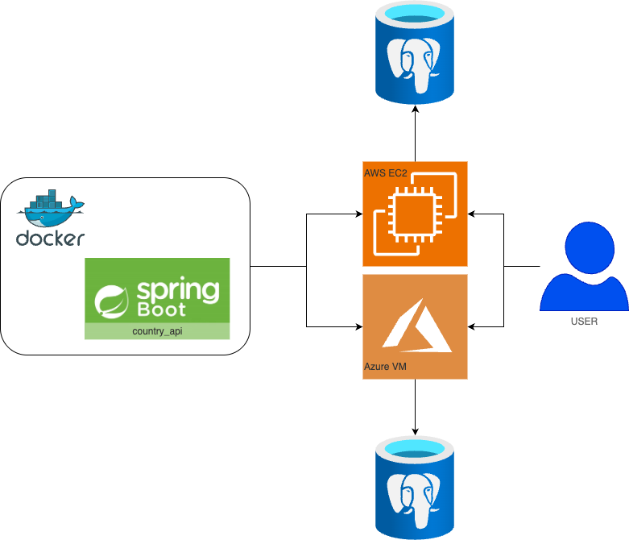

# 🌐 Country API

A Spring Boot microservice for managing and querying country and regional data, including capitals, altitudes,
population, and land area. Designed to demonstrate practical microservice architecture, containerization, and cloud
deployment skills.

---

## 👷 Maintainers/Contributors

- Maintainer: [Timothy Storm](mailto:timothystorm@gmail.com)

---

## 🧩 Features

- RESTful API for country and regional data
- PostgreSQL-backed persistence
- Dev/Prod profile separation
- Dockerized for local and cloud deployment
- Cloud-ready: tested on AWS EC2 and Azure Virtual Machines

---

## 🛠️ Tech Stack

| Layer      | Tech                      |
|------------|---------------------------|
| Backend    | Spring Boot (Gradle)      |
| Database   | PostgreSQL (Dockerized)   |
| Container  | Docker                    |
| Deployment | AWS EC2, Azure VM         |
| CI/CD      | GitHub Actions (optional) |

---

## ☁️ Cloud Deployment

This app is designed for deployment via GitHub Actions to either:

- AWS EC2: Using SSH + Docker
- Azure VM: Using SSH + Docker

Includes CI/CD examples that:

- Build the Docker image
- Copy it to the VM
- Run the container with environment-injected DB credentials

---

## 📚 API Overview

| Method | Endpoint                   | Description               |
|--------|----------------------------|---------------------------|
| GET    | /api/regionalentities      | Get all regions           |
| POST   | /api/regionalentities      | Add a new regional entity |
| PUT    | /api/regionalentities      | Update an existing entity |
| DELETE | /api/regionalentities/{id} | Delete a region by ID     |

## 💡 Skills Demonstrated

- Clean REST API design
- JPA with PostgreSQL
- Docker containerization and orchestration
- Environment-based Spring profiles
- CI/CD automation via GitHub Actions
- Cloud-native architecture on both AWS and Azure
- Secure configuration practices (no credentials in repo)

---

## 🤝 Conventions & Standards

- 🪾 [Trunk based development](https://trunkbaseddevelopment.com/)
  - short lived branches - no more than a week
- 🪟 [No broken windows](https://blog.codinghorror.com/the-broken-window-theory/)
  - treat warning like errors
  - all errors are treated as critical and to be fixed immediately
- 🚑 Refactoring is expected and is NOT a dirty word

---

## 🚧 TODO / Future Enhancements

- Add unit and integration tests
- Add Swagger/OpenAPI documentation
- Add auth with Spring Security or JWT

---

## 🧠 Why This Project?

This project was built to showcase end-to-end backend development and deployment expertise, particularly in:

- Real-world microservice setup
- Secure and portable deployment pipelines
- Hands-on cloud and Docker experience

---

## 🏛️ Architecture

